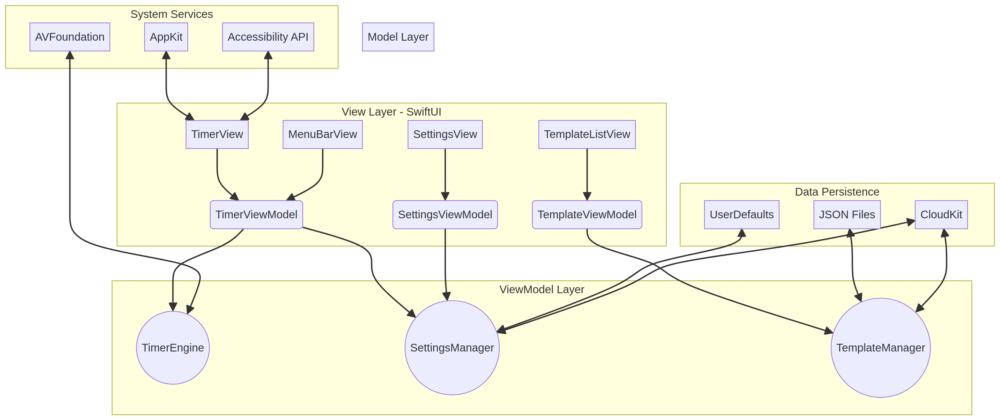

# TimeKeeper Pro for Mac

## Mac App Store 無料アプリ 設計仕様書

**バージョン**: 1.0  
**作成日**: 2026年1月31日  
**作成者**: Manus AI  
**ステータス**: 設計完了

---

## 目次

1. [エグゼクティブサマリー](#1-エグゼクティブサマリー)
2. [プロダクト概要](#2-プロダクト概要)
3. [アーキテクチャ設計](#3-アーキテクチャ設計)
4. [機能仕様](#4-機能仕様)
5. [ユニバーサルデザイン](#5-ユニバーサルデザイン)
6. [多言語対応](#6-多言語対応)
7. [技術仕様](#7-技術仕様)
8. [Mac App Store配布要件](#8-mac-app-store配布要件)
9. [開発ロードマップ](#9-開発ロードマップ)
10. [参考資料](#参考資料)

---

## 1. エグゼクティブサマリー

本ドキュメントは、Chrome拡張機能として設計された「TimeKeeper Pro」を、Mac App Storeで無料配布するネイティブmacOSアプリケーションとして再設計するための包括的な仕様書です。

本アプリケーションは、セミナー登壇者や司会者がスライド操作を妨げることなく、画面上に半透明のカウントダウンタイマーを表示し、時間帯に応じた色分けで直感的に残り時間を把握できるツールです。macOSネイティブアプリとして再設計することで、Chrome拡張機能では実現が難しかった高度なウィンドウ制御、システム統合、そしてAppleのエコシステムを活用したデバイス間同期を実現します。

設計の核となる原則は、**ユニバーサルデザイン**と**多言語対応**です。すべてのユーザーが身体的な能力や言語に関わらずアプリの全機能にアクセスできるよう、Appleのヒューマンインターフェイスガイドラインとアクセシビリティ基準に完全準拠します。

---

## 2. プロダクト概要

### 2.1 製品名

**TimeKeeper Pro** - プロフェッショナル向けタイムキーパー Mac アプリケーション

### 2.2 コンセプト

セミナー登壇者・司会者がスライド操作を妨げることなく、画面上に半透明でカウントダウンタイマーを表示し、時間帯に応じた色分けで直感的に残り時間を把握できるツール。macOSネイティブアプリとして、より深いシステム統合と優れたユーザー体験を提供します。

### 2.3 ターゲットユーザー

本アプリケーションは、時間管理が重要なプロフェッショナルユーザーを主な対象としています。具体的には、セミナー・講演の登壇者、司会者・タイムキーパー担当者、オンライン会議のファシリテーター、YouTubeライブ配信者、そしてプレゼンテーション実施者が含まれます。これらのユーザーは、プレゼンテーション中に他のアプリケーションの操作を妨げることなく、残り時間を常に確認したいというニーズを持っています。

### 2.4 Chrome拡張機能からの主な変更点

| 項目 | Chrome拡張機能 | Mac App |
| :--- | :--- | :--- |
| **プラットフォーム** | Chrome ブラウザ上 | macOS ネイティブ |
| **ウィンドウ制御** | 制限あり（ブラウザの制約） | 完全制御（最前面、クリックスルー、透明度） |
| **マルチモニター** | 限定的 | 完全対応（NSScreen API） |
| **データ同期** | Chrome Sync Storage | iCloud (CloudKit) |
| **配布** | Chrome Web Store | Mac App Store |
| **価格** | 無料 | 無料 |

---

## 3. アーキテクチャ設計

### 3.1 全体構成

アプリケーションは、SwiftUIを主体としたモダンなアーキテクチャを採用し、UIとビジネスロジックを明確に分離するMVVM (Model-View-ViewModel) パターンを基本とします。



```
┌─────────────────────────────────────────────────────────────────┐
│                         TimeKeeper Pro                          │
├─────────────────────────────────────────────────────────────────┤
│                                                                 │
│  ┌─────────────────────────────────────────────────────────┐   │
│  │                    View Layer (SwiftUI)                  │   │
│  │  ┌──────────┐  ┌──────────┐  ┌──────────┐  ┌─────────┐ │   │
│  │  │TimerView │  │Settings  │  │Template  │  │MenuBar  │ │   │
│  │  │          │  │View      │  │ListView  │  │View     │ │   │
│  │  └────┬─────┘  └────┬─────┘  └────┬─────┘  └────┬────┘ │   │
│  └───────┼─────────────┼─────────────┼─────────────┼──────┘   │
│          │             │             │             │           │
│  ┌───────┴─────────────┴─────────────┴─────────────┴──────┐   │
│  │                  ViewModel Layer                        │   │
│  │  ┌──────────────┐  ┌──────────────┐  ┌──────────────┐  │   │
│  │  │TimerViewModel│  │SettingsVM   │  │TemplateVM   │  │   │
│  │  └──────┬───────┘  └──────┬───────┘  └──────┬───────┘  │   │
│  └─────────┼─────────────────┼─────────────────┼──────────┘   │
│            │                 │                 │               │
│  ┌─────────┴─────────────────┴─────────────────┴──────────┐   │
│  │                    Model Layer                          │   │
│  │  ┌─────────────┐  ┌─────────────┐  ┌─────────────┐     │   │
│  │  │TimerEngine  │  │Settings     │  │Template     │     │   │
│  │  │             │  │Manager      │  │Manager      │     │   │
│  │  └──────┬──────┘  └──────┬──────┘  └──────┬──────┘     │   │
│  └─────────┼────────────────┼────────────────┼────────────┘   │
│            │                │                │                 │
│  ┌─────────┴────────────────┴────────────────┴────────────┐   │
│  │                  System Services                        │   │
│  │  ┌────────────┐  ┌────────────┐  ┌────────────┐        │   │
│  │  │AVFoundation│  │CloudKit    │  │AppKit      │        │   │
│  │  │(Audio)     │  │(Sync)      │  │(Window)    │        │   │
│  │  └────────────┘  └────────────┘  └────────────┘        │   │
│  └────────────────────────────────────────────────────────┘   │
│                                                                 │
│  ┌────────────────────────────────────────────────────────┐   │
│  │              Remote Control Layer                       │   │
│  │  ┌──────────────────────┐  ┌─────────────────────────┐ │   │
│  │  │ RemoteControlService │  │  Network.framework /    │ │   │
│  │  │ HTTP :8080           │  │  Bonjour (mDNS)         │ │   │
│  │  │ WebSocket :8081      │  │                         │ │   │
│  │  └──────────────────────┘  └─────────────────────────┘ │   │
│  └────────────────────────────────────────────────────────┘   │
│                                                                 │
└─────────────────────────────────────────────────────────────────┘
```

### 3.2 コンポーネント詳細

**View Layer (SwiftUI)** は、ユーザーインターフェースの構築を担当します。`TimerView`がメインのタイマー表示を、`SettingsView`が詳細設定画面を、`TemplateListView`がテンプレートの一覧と選択を、`MenuBarView`がメニューバーからのクイックアクセスを提供します。SwiftUIの宣言的な構文により、状態の変化に応じてUIが自動的に更新されます。

**ViewModel Layer** は、Viewの状態とビジネスロジックの橋渡しを行います。`@Published`プロパティを通じてViewにデータをバインドし、ユーザーの操作をModel層に伝達します。`Combine`フレームワークを活用し、リアクティブなデータフローを実現します。

**Model Layer** は、アプリケーションの中核となるビジネスロジックを実装します。`TimerEngine`は高精度なタイマー処理を、`SettingsManager`はユーザー設定の永続化と取得を、`TemplateManager`はテンプレートのCRUD操作とエクスポート/インポートを担当します。

**System Services** は、macOSのシステム機能との連携を担当します。`AVFoundation`で音声通知や読み上げ機能を、`CloudKit`でiCloud経由のデータ同期を、`AppKit`でウィンドウの高度な制御（最前面表示、クリックスルー、透明度調整）を実現します。

---

## 4. 機能仕様

### 4.1 タイマー表示モード

本アプリケーションは、ユーザーの好みや利用シーンに応じて、3つの表示モードを提供します。

**デジタルカウントダウン**は、大きな数字で残り時間を表示するモードです。フォーマットは`MM:SS`または`HH:MM:SS`から選択でき、フォントサイズは小/中/大/特大の4段階に加え、カスタムpx指定も可能です。視認性を重視し、モノスペースフォントをデフォルトとして採用します。

**文字盤（アナログ風）カウントダウン**は、円形のプログレスリングで残り時間を視覚的に表現するモードです。12時位置からスタートし、時計回りに減少していくビジュアルにより、直感的に残り時間の割合を把握できます。中央にデジタル表示を重ねるオプションも用意します。

**デュアルカウントダウン**は、デジタルと文字盤を同時に表示するモードです。上下配置または左右配置を選択でき、それぞれ独立してサイズを調整できます。

### 4.2 フェーズカラー機能

時間の経過に応じて表示色を自動的に変更する「フェーズカラー機能」は、本アプリケーションの中核機能です。最大8段階の色分けを設定でき、各段階には開始時間、終了時間、表示色、ラベル名を指定できます。

| フェーズ | 時間範囲 | 色 | 意味 |
| :---: | :--- | :--- | :--- |
| 1 | 90:00 〜 60:00 | 青 (#3B82F6) | 余裕あり |
| 2 | 59:59 〜 30:00 | 緑 (#22C55E) | 順調 |
| 3 | 29:59 〜 10:00 | 黄 (#EAB308) | 注意 |
| 4 | 09:59 〜 05:00 | 橙 (#F97316) | 警告 |
| 5 | 04:59 〜 01:00 | 赤 (#EF4444) | 終了間近 |
| 6 | 00:59 〜 00:00 | 赤点滅 | 最終カウント |

色の切り替えは、「パッと切り替え」（即座に色変更）と「グラデーション遷移」（5秒かけて滑らかに変化）の2種類から選択できます。

### 4.3 ウィンドウ・表示設定

**透明度調整**では、ウィンドウ全体の透明度を0%〜95%の範囲でスライダー調整できます。「背景のみ透明」（文字はくっきり）と「文字も含めて透明」の2モードを提供し、「くっきり」「やや透明」「うっすら」「ほぼ透明」の4つのプリセットも用意します。

**サイズ調整**では、S/M/L/XLのプリセットサイズに加え、幅・高さをpx単位で指定するカスタムサイズをサポートします。ウィンドウの角をドラッグしてリサイズする機能も実装し、アスペクト比固定オプションも提供します。

**位置設定**では、タイマー領域をドラッグして自由に配置できます。画面端・中央へのスナップ機能（ON/OFF可能）、位置プリセット（右上/右下/左上/左下/上中央/下中央/画面中央）、そして最後に配置した位置の自動保存機能を実装します。

**最前面設定**では、「常に最前面」のON/OFFトグル、「クリックスルー」（タイマーをすり抜けて下の要素をクリック可能）、「フォーカス時のみ前面」の3つのオプションを提供します。

### 4.4 マルチモニター対応

macOSネイティブアプリの強みを活かし、マルチモニター環境を完全にサポートします。

**ミラーリングモード**では、メインモニターのタイマー位置をそのまま他のモニターに複製し、全モニターで同一表示を実現します。**拡張モニターモード**では、タイマーを表示するモニターを選択でき、各モニターで異なる位置・サイズを設定できます。これにより、「登壇者用モニターには大きく表示、観客席向けスクリーンには控えめに表示」といった運用が可能になります。

`NSScreen.screens` APIを用いて接続モニターを自動検出し、設定画面でモニターのプレビューを表示します。

### 4.5 テンプレート機能

頻繁に使用する設定をテンプレートとして保存・呼び出しできます。

**プリセットテンプレート**として、90分セミナー、60分講演、45分授業、30分プレゼン、20分LT、15分ショート、10分ピッチ、5分発表、ポモドーロ（25分）、休憩タイマー（10分）を組み込みで提供します。

**カスタムテンプレート**では、ゼロからの新規作成、既存テンプレートの複製・編集、任意の名前での保存、フォルダ/タグによる整理、JSON形式でのエクスポート/インポートをサポートします。

### 4.6 キーボードショートカット

| 操作 | デフォルトショートカット |
| :--- | :--- |
| スタート/一時停止 | `Space` |
| リセット | `⌘R` |
| +1分 | `↑` |
| -1分 | `↓` |
| +5分 | `⇧↑` |
| -5分 | `⇧↓` |
| 表示/非表示 | `⌘H` |
| 残り/経過切替 | `T` |
| 設定画面を開く | `⌘,` |
| フルスクリーン | `⌃⌘F` |

すべてのショートカットはユーザーがカスタマイズ可能であり、`NSEvent.addGlobalMonitorForEvents`を用いてアプリが非アクティブな状態でも動作するグローバルショートカットとして実装します。

---

### 4.7 リモートコントロール機能

登壇者がステージ上でスライドを操作しながら、手元のスマートフォンやタブレットからタイマーを遠隔操作できる機能です。PCに触れることなくタイマーを制御できるため、プレゼンテーションの流れを妨げません。

#### 4.7.1 概要

同一LAN上の任意のデバイス（iPhone、iPad、Android、別のMac）のWebブラウザからタイマーを操作できます。専用アプリのインストールは不要で、ブラウザのみで動作します。

#### 4.7.2 アーキテクチャ

TimeKeeper Pro Mac アプリが**内蔵HTTPサーバー**および**WebSocketサーバー**をローカルネットワーク上に公開します。

```
┌─────────────────────────────────────────┐
│          TimeKeeper Pro (Mac)           │
│                                         │
│  ┌──────────────────────────────────┐   │
│  │        RemoteControlService      │   │
│  │  ┌─────────────┐ ┌────────────┐  │   │
│  │  │  HTTP Server│ │  WebSocket │  │   │
│  │  │  (静的UI配信)│ │  Server    │  │   │
│  │  │  :8080      │ │  :8081     │  │   │
│  │  └──────┬──────┘ └─────┬──────┘  │   │
│  └─────────┼──────────────┼─────────┘   │
│            │              │             │
│  ┌─────────┴──────────────┴─────────┐   │
│  │           TimerViewModel         │   │
│  └──────────────────────────────────┘   │
└─────────────────────────────────────────┘
         ↑ LAN (Wi-Fi / 有線)
┌────────────────────────────────────────┐
│  リモートデバイス（ブラウザ）            │
│  iPhone / iPad / Android / 他のMac     │
│  http://<MacのIPアドレス>:8080         │
└────────────────────────────────────────┘
```

**Bonjour (mDNS)** を使用してMac上のサービスを自動広告し、リモートデバイスが `http://timekeeperpro.local:8080` でアクセスできるようにします。IPアドレスの手動入力は不要です。

#### 4.7.3 セキュリティ

- **ローカルネットワーク限定**: サーバーはループバック (`127.0.0.1`) ではなく LAN インターフェースにのみバインドし、インターネットからはアクセス不可
- **PINコード認証**: 4〜8桁の数字PINを設定画面で設定。接続時にPINを要求（デフォルト: ランダム生成4桁）
- **セッショントークン**: PIN認証後に発行されるセッショントークン（UUID）をすべてのリクエストに付与
- **接続承認モード（オプション）**: 新規デバイスの接続時にMac側でポップアップ通知を表示し、ユーザーが承認するまで操作を拒否する

#### 4.7.4 REST API 仕様

ベースURL: `http://<host>:8080/api/v1`
認証ヘッダー: `X-Session-Token: <token>`

| メソッド | エンドポイント | 説明 |
| :--- | :--- | :--- |
| `GET` | `/status` | タイマーの現在状態を取得 |
| `POST` | `/timer/start` | タイマーをスタート / 一時停止解除 |
| `POST` | `/timer/pause` | タイマーを一時停止 |
| `POST` | `/timer/reset` | タイマーをリセット |
| `POST` | `/timer/adjust` | 残り時間を調整（`{ "seconds": 60 }` で +1分） |
| `PUT` | `/timer/duration` | タイマー時間を設定（`{ "seconds": 3600 }`） |
| `GET` | `/templates` | テンプレート一覧を取得 |
| `POST` | `/templates/:id/load` | テンプレートを読み込んでタイマーを設定 |
| `POST` | `/auth/pin` | PINコードを送信してセッショントークンを取得 |

**`GET /status` レスポンス例:**
```json
{
  "state": "running",
  "remainingSeconds": 2743,
  "totalSeconds": 5400,
  "currentPhase": {
    "label": "順調",
    "color": "#22C55E"
  },
  "displayMode": "digital"
}
```

#### 4.7.5 WebSocket イベント仕様

WebSocket URL: `ws://<host>:8081/ws?token=<session-token>`

タイマーの状態変化をリアルタイムにリモートデバイスへプッシュ配信します。

**サーバー → クライアント（イベント）:**

| イベント | ペイロード | 説明 |
| :--- | :--- | :--- |
| `tick` | `{ remainingSeconds, totalSeconds }` | 毎秒送信される残り時間更新 |
| `stateChanged` | `{ state: "running" \| "paused" \| "stopped" }` | タイマー状態変化 |
| `phaseChanged` | `{ phase: { label, color } }` | フェーズ切り替え |
| `timerFinished` | `{}` | カウントダウン終了 |

**クライアント → サーバー（コマンド）:**

```json
{ "command": "start" }
{ "command": "pause" }
{ "command": "reset" }
{ "command": "adjust", "seconds": -60 }
{ "command": "loadTemplate", "templateId": "uuid-string" }
```

#### 4.7.6 リモートコントロール Web UI

`http://<host>:8080` でアクセスできる組み込みWebアプリを提供します。追加インストール不要で、任意のブラウザから操作できます。

**UI 構成:**

```
┌──────────────────────────────────┐
│        TimeKeeper Pro Remote     │
├──────────────────────────────────┤
│                                  │
│         25:43                    │
│     [████████░░░░░░] 47%         │
│                                  │
│  ┌────────┐  ┌────────────────┐  │
│  │  ▶ 開始 │  │  ■ リセット    │  │
│  └────────┘  └────────────────┘  │
│                                  │
│  ┌────────┐  ┌────────┐          │
│  │  -1分  │  │  +1分  │          │
│  └────────┘  └────────┘          │
│  ┌────────┐  ┌────────┐          │
│  │  -5分  │  │  +5分  │          │
│  └────────┘  └────────┘          │
│                                  │
│  テンプレート: [60分講演      ▼]  │
└──────────────────────────────────┘
```

- レスポンシブデザイン（スマートフォン・タブレット対応）
- ダークモード対応
- タイマー残り時間・フェーズカラーをリアルタイム反映

#### 4.7.7 設定

設定画面の「リモートコントロール」セクションで以下を設定できます。

| 設定項目 | デフォルト | 説明 |
| :--- | :--- | :--- |
| リモートコントロール有効 | OFF | 機能のON/OFF |
| ポート番号 | 8080 / 8081 | HTTP / WebSocketポート |
| PINコード | ランダム4桁 | 接続認証用PIN |
| 接続承認モード | OFF | 新規接続を手動承認する |
| アクセス用QRコード表示 | — | URLとPINのQRコードを画面表示 |

設定画面にはQRコード表示ボタンを設け、タップするとURLとPINを含むQRコードが表示され、スマートフォンのカメラで簡単に接続できます。

---

## 5. ユニバーサルデザイン

すべてのユーザーが、身体的な能力や状況に関わらず、アプリの全機能にアクセスし、快適に操作できることを目指します。Appleのヒューマンインターフェイスガイドラインに準拠し、以下の設計原則を適用します。[1]

### 5.1 視覚アクセシビリティ

視覚に障害のあるユーザーや、多様な視覚特性を持つユーザーに対応するため、以下の機能を実装します。

**ダイナミックタイプ対応**として、全てのテキスト要素はシステムのフォントサイズ設定に追従します。ユーザーは「システム環境設定」から自分に合った文字サイズを選択でき、アプリの表示もそれに合わせて自動調整されます。macOSのデフォルトフォントサイズは13pt、最小サイズは10ptを基準とします。[1]

**コントラスト比の確保**として、UI要素の色のコントラスト比はWCAG 2.1のAA基準を満たします。具体的には、通常テキストで4.5:1以上、大きなテキスト（18pt以上）で3:1以上を確保します。システムの「コントラストを上げる」設定にも対応し、よりハイコントラストな表示を提供します。[1]

**VoiceOver完全対応**として、すべてのUIコントロール（ボタン、スライダー、テキストフィールド等）に、その役割を説明するアクセシビリティラベルを付与します。タイマーの残り時間やフェーズの切り替えも、VoiceOverが適切に読み上げます。

**色以外の情報伝達**として、フェーズの切り替えやアラートなど、色で状態を表現する箇所では、必ずアイコンの変化、テキストラベル、シンボルの表示など、色以外の視覚的要素を併用します。

**モーションの削減**として、システムの「視差効果を減らす」設定がオンの場合、グラデーション遷移やパルスアニメーションなどの視覚効果を無効化、またはシンプルなフェード効果に代替します。

### 5.2 操作性アクセシビリティ

マウスやトラックパッドの操作が困難なユーザーにも配慮し、以下の機能を実装します。

**フルキーボードアクセス**として、アプリのすべての機能はキーボード操作のみで完結できるように設計します。Tabキーでコントロール間を移動し、SpaceキーやEnterキーで実行する、macOS標準のキーボードナビゲーションに準拠します。

**コントロールサイズ**として、クリックやタップの対象となるコントロールの最小サイズは、Appleの推奨する28x28pt（最小20x20pt）を確保し、誤操作を防ぎます。要素間のパディングは12pt以上を確保します。[1]

### 5.3 聴覚アクセシビリティ

聴覚に障害のあるユーザーや、音声を出せない環境での利用を想定し、以下の機能を実装します。

**視覚的通知**として、チャイム音やブザー音などの音声通知が発生する場面では、必ず画面のフラッシュ、ウィンドウ枠のハイライト、アイコンの変化といった視覚的なフィードバックを同時に提供します。

**音声読み上げの代替**として、「残り10分です」といった音声読み上げ機能は、画面上にカスタムメッセージとして表示するオプションも提供します。

---

## 6. 多言語対応

世界中のユーザーが母国語で自然にアプリを利用できるよう、国際化（i18n）と地域化（l10n）を徹底します。App Storeは175地域、40言語に対応しており、本アプリケーションもグローバル展開を視野に入れた設計を行います。[2]

### 6.1 対応言語

ユーザーの要望である「フル言語設定」に基づき、段階的に対応言語を拡大します。

**初期対応言語 (Tier 1)** は、英語、日本語、中国語（簡体字）、ドイツ語、フランス語、スペイン語、韓国語の7言語です。これらは世界の主要市場をカバーし、App Storeでの露出を最大化します。

**順次対応言語 (Tier 2)** は、イタリア語、ポルトガル語（ブラジル/ポルトガル）、ロシア語、オランダ語、トルコ語、ポーランド語です。

**将来対応言語 (Tier 3)** は、アラビア語、ヘブライ語、タイ語、ベトナム語、インドネシア語など、RTL（右から左）言語を含む追加言語です。

### 6.2 実装方針

**String Catalogs**として、Xcode 15以降で導入された`.xcstrings`形式を全面的に採用します。これにより、翻訳作業の効率化、複数形や文法的な性の一致の自動処理、コンテキストの提供が容易になります。[2]

**UIレイアウト**として、SwiftUIの`Auto Layout`機能を活用し、テキストが長い言語（例: ドイツ語は英語の約1.3倍）でもレイアウトが崩れない、柔軟なUIを構築します。

**日付・数値フォーマット**として、`Formatter` APIを利用し、日付、時刻、数値をユーザーの地域の標準形式で自動的に表示します。

**右から左 (RTL) 対応**として、アラビア語やヘブライ語など、右から左に記述する言語に対応します。UI要素の配置が自動的に反転するよう、SwiftUIの標準機能を活用します。

### 6.3 翻訳ワークフロー

翻訳作業は以下のワークフローで実施します。まず、Xcodeの機能を用いて翻訳対象の文字列をXLIFF形式でエクスポートします。次に、専門の翻訳者または翻訳サービスにXLIFFファイルを提供し、各言語への翻訳を依頼します。翻訳済みのXLIFFファイルをXcodeにインポートし、アプリに反映します。最後に、各言語で表示やレイアウトの崩れがないか、実機およびシミュレータでテストを実施します。

---

## 7. 技術仕様

### 7.1 使用技術

| カテゴリ | 技術 | 目的 |
| :--- | :--- | :--- |
| **言語** | Swift 5.10+ | 安全性とパフォーマンスを両立したAppleプラットフォームの標準言語 |
| **UIフレームワーク** | SwiftUI, AppKit | SwiftUIをメインに採用し、宣言的でアクセシビリティ対応が容易なUIを構築。ウィンドウの高度な制御はAppKitを併用 |
| **非同期処理** | Combine, async/await | タイマー処理やデータ同期などの非同期処理を、モダンで可読性の高いコードで実装 |
| **データ永続化** | UserDefaults, Codable, CloudKit | 設定の保存、テンプレートのシリアライズ、iCloud経由のデータ同期 |
| **音声** | AVFoundation | チャイム音の再生、残り時間の音声読み上げ |
| **国際化** | String Catalogs | 翻訳管理の効率化 |
| **アクセシビリティ** | Accessibility API | VoiceOver、フルキーボードアクセス、ダイナミックタイプ対応 |

### 7.2 Chrome拡張機能からの機能マッピング

| Chrome拡張機能 | macOSネイティブアプリでの実現方法 |
| :--- | :--- |
| **オーバーレイ表示** | `NSWindow`の`level`を`.floating`に設定し、`isOpaque`を`false`、`backgroundColor`を`.clear`にすることで、常に最前面に表示される半透明ウィンドウを実現 |
| **クリックスルー** | `NSWindow`の`ignoresMouseEvents`プロパティを`true`に設定 |
| **マルチモニター対応** | `NSScreen.screens`を用いて接続されている全ディスプレイの情報を取得 |
| **設定の同期** | `CloudKit`を利用し、Apple IDに紐づくプライベートデータベースでテンプレートや設定を同期 |
| **グローバルショートカット** | `NSEvent.addGlobalMonitorForEvents(matching:handler:)`を利用 |

### 7.3 ファイル構成

```
TimeKeeperPro/
├── App/
│   └── TimeKeeperProApp.swift      # アプリエントリーポイント
├── Views/
│   ├── TimerView.swift             # メインタイマー表示
│   ├── SettingsView.swift          # 設定画面
│   ├── TemplateListView.swift      # テンプレート一覧
│   └── MenuBarView.swift           # メニューバー表示
├── ViewModels/
│   ├── TimerViewModel.swift        # タイマーロジック
│   ├── SettingsViewModel.swift     # 設定管理
│   └── TemplateViewModel.swift     # テンプレート管理
├── Models/
│   ├── TimerPhase.swift            # フェーズ定義
│   ├── Template.swift              # テンプレートモデル
│   └── AppSettings.swift           # 設定モデル
├── Services/
│   ├── TimerEngine.swift           # タイマーエンジン
│   ├── TemplateManager.swift       # テンプレート永続化
│   ├── SettingsManager.swift       # 設定永続化
│   ├── CloudSyncService.swift      # iCloud同期
│   └── RemoteControlService.swift  # リモートコントロール (HTTP/WebSocket/Bonjour)
├── Resources/
│   ├── Assets.xcassets             # 画像リソース
│   ├── Sounds/                     # 音声ファイル
│   └── Localizable.xcstrings       # 翻訳リソース
└── Supporting Files/
    ├── Info.plist
    └── TimeKeeperPro.entitlements  # App Sandbox設定
```

### 7.4 非機能要件

| 項目 | 要件 |
| :--- | :--- |
| **パフォーマンス** | アイドル時CPU使用率1%未満、動作時5%未満。メモリ使用量100MB未満 |
| **互換性** | macOS 14 Sonoma以降。Apple Silicon + Intel Universal Binary |
| **App Sandbox** | 有効。ファイルアクセスはユーザー許可範囲に限定 |
| **セキュリティ** | ユーザーデータはローカルまたはiCloudのみに保存。外部サーバーへの送信なし |

---

## 8. Mac App Store配布要件

### 8.1 必須要件

Mac App Storeでの配布には、以下の要件を満たす必要があります。[3]

**App Sandbox**は、2012年6月以降、Mac App Storeに提出するすべてのアプリに必須です。アプリはサンドボックス内で動作し、ファイルシステムやネットワークへのアクセスは明示的に許可された範囲に制限されます。

**コード署名**として、Apple Developer Programメンバーシップを取得し、有効な証明書でアプリに署名する必要があります。

**審査ガイドライン準拠**として、Safety（安全性）、Performance（パフォーマンス）、Business（ビジネス）、Design（デザイン）、Legal（法的事項）の5カテゴリの審査基準を満たす必要があります。[3]

### 8.2 無料アプリの要件

無料アプリでも審査は有料アプリと同様に厳格に行われます。品質基準に妥協はなく、ユーザー体験の質が重視されます。広告表示やアプリ内課金は任意であり、本アプリケーションでは初期リリースでは実装しない方針です。

### 8.3 App Store Connect設定

| 項目 | 設定内容 |
| :--- | :--- |
| **カテゴリ** | Productivity / Utilities |
| **価格** | 無料 |
| **対象年齢** | 4+ |
| **App内課金** | なし（初期リリース） |
| **プライバシーポリシー** | 必須（データ収集なしの旨を明記） |

---

## 9. 開発ロードマップ

### Phase 1: MVP（最小実行可能製品）

基本的なカウントダウンタイマー機能を実装します。デジタル表示、4段階の色分け（固定）、透明度調整、ドラッグ移動、スタート/停止/リセット機能を含みます。ユニバーサルデザインの基本対応（VoiceOver、キーボード操作）と、日本語・英語の2言語対応を行います。

### Phase 2: コア機能拡張

文字盤（アナログ風）表示、8段階のカスタム色設定、テンプレート保存/読込、音声通知、キーボードショートカットのカスタマイズ機能を追加します。対応言語を7言語（Tier 1）に拡大します。

### Phase 3: プロフェッショナル機能

マルチモニター対応、複数タイマー、履歴機能、エクスポート/インポート、音声読み上げ、iCloud同期機能を追加します。対応言語をTier 2に拡大します。

### Phase 4: 仕上げ・リリース

パフォーマンス最適化、アクセシビリティ監査と改善、ドキュメント整備、Mac App Store公開準備を行います。

---

## 参考資料

[1]: [Accessibility | Apple Developer Documentation](https://developer.apple.com/design/human-interface-guidelines/accessibility) - Appleのアクセシビリティガイドライン

[2]: [Localization - Apple Developer](https://developer.apple.com/localization/) - Appleのローカライゼーションガイド

[3]: [App Review Guidelines - Apple Developer](https://developer.apple.com/app-store/review/guidelines/) - App Store審査ガイドライン

---

**文書終了**
